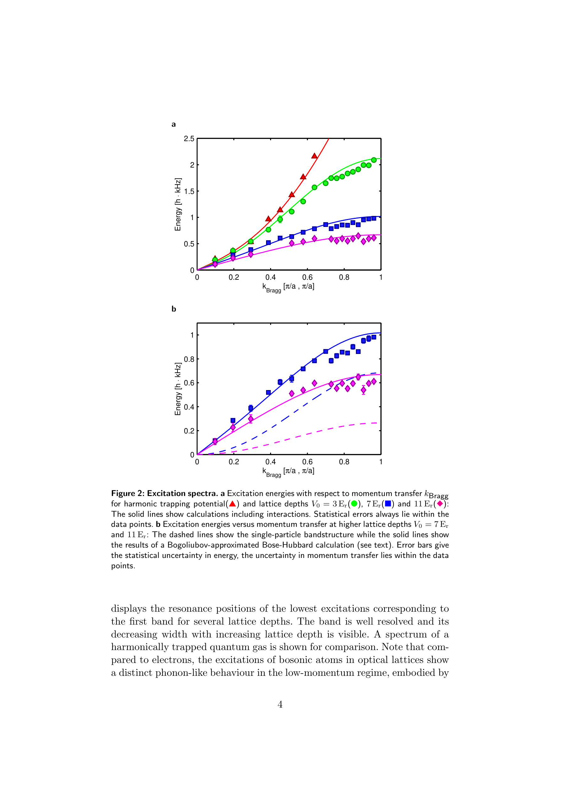
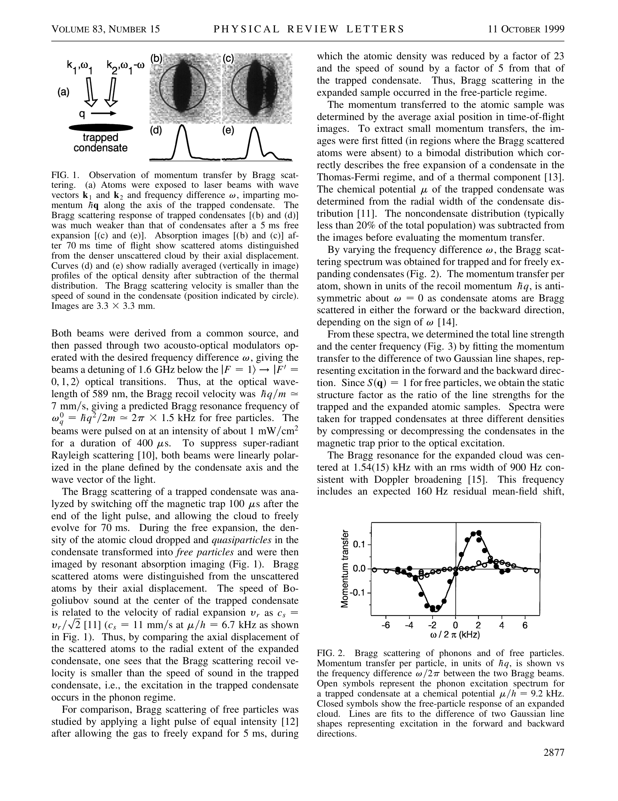
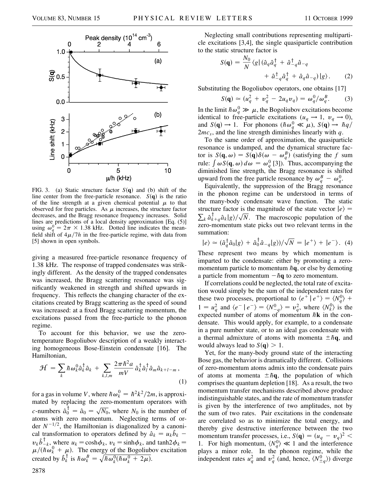

# Quick preview renders (for figure confirmation)

These images are page renders extracted from PDFs in this folder to make figure confirmation easy inside VS Code.

## Active B1 source (Ernst et al., 2009)

- Fig. 2 page render (contains Fig. 2a / Fig. 2b):

## Audit-only (not used for B1 ω(k))

The following renders are from `Stamper-Kurn_1999_PRL.pdf` and are kept only as an audit trail from the earlier candidate review.

- Page 2 render (contains Fig. 2 caption/graphics):

- Page 3 render (contains Fig. 3 caption/graphics):

